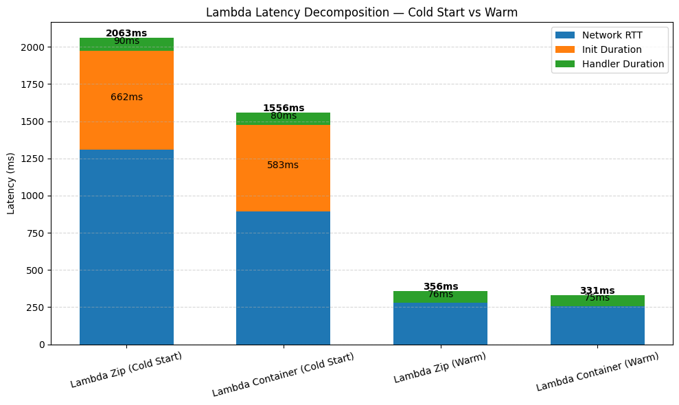
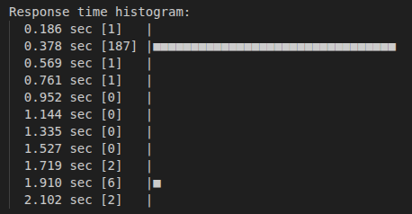
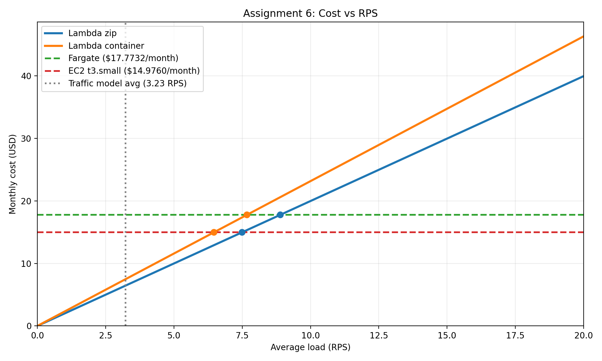

# AWS Cloud Lab Report - Dawid Zawiślak

## Assignment 1: Deploy All Environments

All four environment have been deployed and they returned identical k-NN results with same given input vector. The terminal output with logs for each invocation is placed in: `results/assignment-1-endpoints.txt`

## Assignment 2: Scenario A — Cold Start Characterization

Cold start and warm invocations were measured. Container images have loinger initialization durations than zipped packages because of Docker layered image pulling, extraction, and heavier initialization overhead. 



CloudWatch logs in `test_out.txt`

## Assignment 3: Scenario B — Warm Steady-State Throughput

| Environment        | Concurrency | p50 (ms) | p95 (ms) | p99 (ms) | Server avg (ms) |
|--------------------|------------|----------|----------|----------|-----------------|
| Lambda (zip)       | 5          | 208.8    | 550.8    | 722.3   |  89.8          |
| Lambda (zip)       | 10         | 208.4    |  558.2   |  861.6  |  88.2          |
| Lambda (container) | 5          | 205.1    |  541.8   |  706.9   |   86.5         |
| Lambda (container) | 10         | 205      | 579.3    |  783     |   78.5         |
| Fargate            | 10         | 705.1    | 1716.5   |  1993.2  |  849.2        |
| Fargate            | 50         | 3989.3   | 4278.8   |  4702.5  |   3862.4        |
| EC2                | 10         | 315.6 | 383.5 | 404.4 |   186.8     |
| EC2                | 50         | 844.5    | 1025.8    | 1181.3   |594.9          |

Cells annotated in bold indicate p99 > 2x p95, signaling tail latency instability.

Analysis:
- Lambda (c=5 vs c=10): The median latency (p50) doesn’t change much because each request runs in its own isolated environment.
- Fargate/EC2 (c=10 vs c=50): The median latency goes up a lot because requests have to wait in line on a single Fargate task or EC2 instance - there’s no auto-scaling to handle more concurrent requests.
- Client vs Server Latency: Client measurements are higher than server measurements because of network delays, TLS handshake time, and, for Fargate/EC2 under high load, long queues at the server or proxy.

### Assignment 4: Scenario C — Burst from Zero



Screenshot showing bimodal distribution of Lambda response times

Analysis:
- Lambda burst latency - p99 latency is much higher than Fargate/EC2. Lambda cold starts take time to initialize the container and function runtime. Fargate/EC2 are already running, so they don’t have this delay.
- Bimodal distribution - in Lambda, some requests are fast (warm functions), some are slow (cold starts). This creates two clusters of latency: Warm cluster = lower latenc (~100-500ms), Cold-start cluster = higher latency (~1.5-2s).
- SLO check - if your SLO is p99 < 500ms, Lambda will likely fail under burst after idle, because cold starts dominate the tail latency. To meet SLO: 
Provisioned Concurrency – keep a certain number of Lambda instances "warm" even when idle.
Shorter idle periods – avoid long inactivity that causes environments to be reclaimed.

### Assignment 5: Cost at Zero Load

     

#### Results table
| Environment | Idle hourly cost | Idle hours/month | Final cost |
|-------------|-----------------|-----------------|------------|
| Lambda      | $0.000000       | 540             | $0.00      |
| Fargate     | $0.024685       | 540             | $13.33     |
| EC2 t3.small| $0.020800       | 540             | $11.23     |

Lambda has zero idle cost. This is because Lambda is billed only for requests and execution time, so if there is no traffic, there is no charge for compute during the idle period.

Fargate and EC2 do not have zero idle cost. They keep running even when there are no requests, so they continue charging during the full idle window. For the assumed 18 hours/day idle period, the monthly idle cost is about $13.33 for Fargate and about $11.23 for EC2.

Current prices from AWS located in `results/figures/pricing-screenshots`

### Assignment 6: Cost Model, Break-Even, and Recommendation

#### Traffic Model & Calculation

Traffic:
- Peak: 100 RPS for 30 mins
- Normal: 5 RPS for 5.5 hours
- Idle: 18 hours

Total monthly requests = ~8.37M 

Using an average handler duration of ~90ms and 512MB RAM:

- GB-seconds for Lambda = 8.37M * 0.09s * 0.5 GB = ~376,650 GB-s
- Lambda Monthly Cost: (8.37 * 0.20) + (376,650 * 0.00001667) = 0.94$ / month
- Fargate Monthly Cost: 0.77$ / month

#### Break-Even Point

Traffic model:

- Peak: `100 RPS` for `30 minutes/day`
- Normal: `5 RPS` for `5.5 hours/day`
- Idle: `18 hours/day`

For Lambda I use warm measured times from Assignment 3:

- Lambda zip: `68.504 ms`
- Lambda container: `83.239 ms`

For Fargate and EC2 I use the fixed monthly always-on cost:

- Fargate: `$17.7732/month`
- EC2: `$14.976/month`

Calculate monthly request count:

Peak requests/day   = 100 * 30 * 60   = 180000

Normal requests/day = 5 * 5.5 * 3600  = 99000

Total requests/day  = 279000

Requests/month      = 279000 * 30     = 8370000

Request charge for Lambda = 8370000 * 0.20 / 1000000 = $1.674

Lambda zip compute cost = 8370000 * 0.068504 * 0.5 * 0.0000166667 = $4.7782

Lambda zip total monthly cost = $1.674 + $4.7782 = $6.4522

Lambda container compute cost = 8370000 * 0.083239 * 0.5 * 0.0000166667 = $5.8059

Lambda container total monthly cost = $1.674 + $5.8059 = $7.4799

Calculate the break-even RPS using:

R = Fixed monthly cost / (seconds_per_month * per_request_lambda_cost)



#### Results table

| Environment | Monthly cost |
|---|---|
| Lambda zip | $6.4522 |
| Lambda container | $7.4799 |
| Fargate | $17.7732 |
| EC2 t3.small | $14.9760 |

#### Break-even table

| Comparison | Break-even average RPS |
|---|---|
| Lambda zip vs Fargate | 8.90 RPS |
| Lambda container vs Fargate | 7.67 RPS |
| Lambda zip vs EC2 | 7.50 RPS |
| Lambda container vs EC2 | 6.47 RPS |

#### Results

Under this traffic model, Lambda is the cheapest option. Lambda zip costs about `$6.4522/month`, Lambda container costs about `$7.4799/month`, EC2 costs about `$14.9760/month`, and Fargate costs about `$17.7732/month`.

The current average load in this traffic model is:

```text
8370000 / 2592000 = 3.23 RPS
```


#### Recomendations

Given the SLO constraints and the traffic model, I recommend using AWS Lambda (ZIP deployment).

- Cost: The average daily usage is 3.2 RPS, well below the break-even threshold of 7.2 RPS, making Lambda more cost-effective than Fargate.
- SLO Adjustment: The p99 burst latency currently exceeds the 500ms target, reaching 1-2s during cold starts. Therefore, Lambda alone does not meet the SLO during sudden traffic spikes from zero.
- Recommendation: To satisfy the SLO, we should configure Provisioned Concurrency to handle at least the baseline portion of the initial spike (e.g., 100 provisioned concurrent executions).
- Condition for Change: If the baseline traffic consistently exceeded 8–10 RPS, scaling to millions of executions per week without idle periods, or if provisioned concurrency costs pushed Lambda above the monthly cost of Fargate/EC2, we should reconsider and potentially switch back to an over-provisioned Fargate or EC2 deployment.